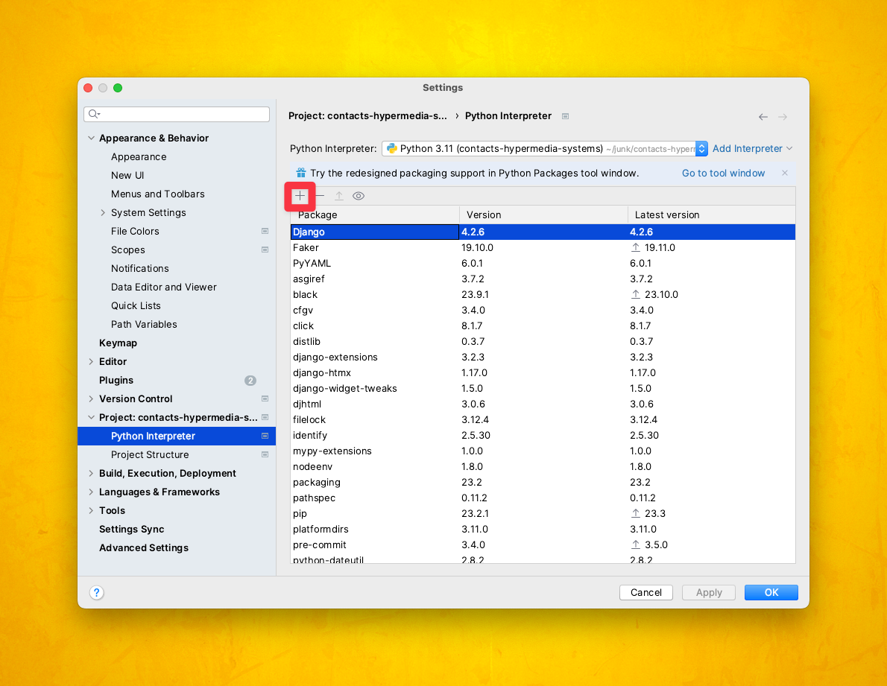
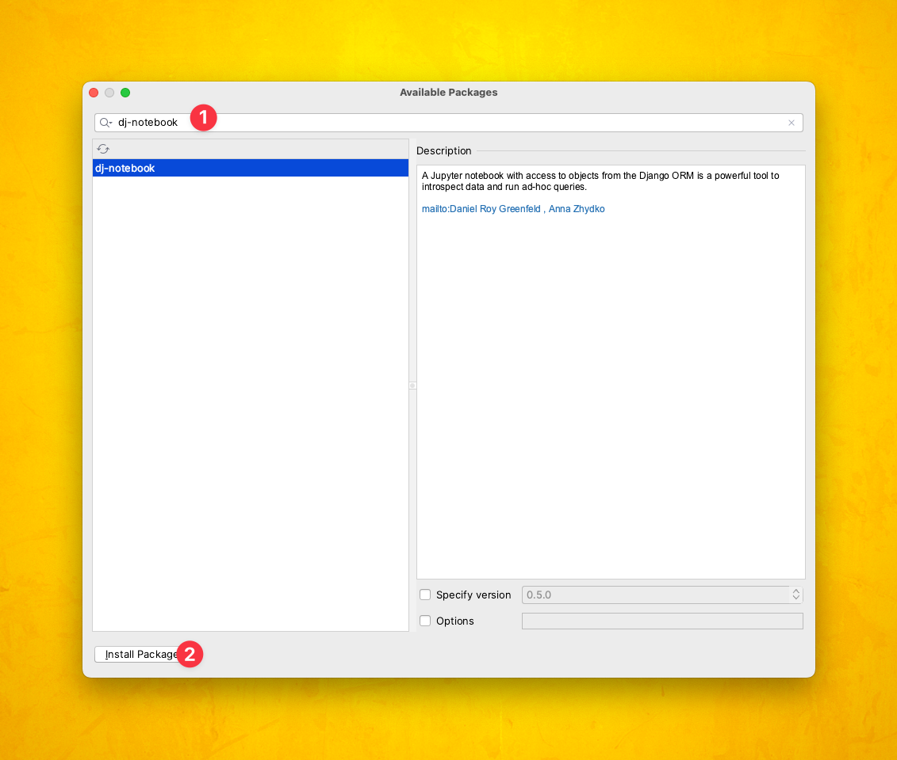
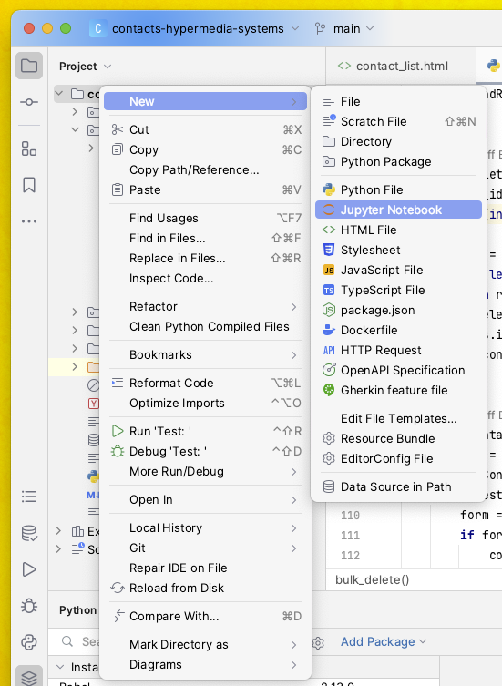
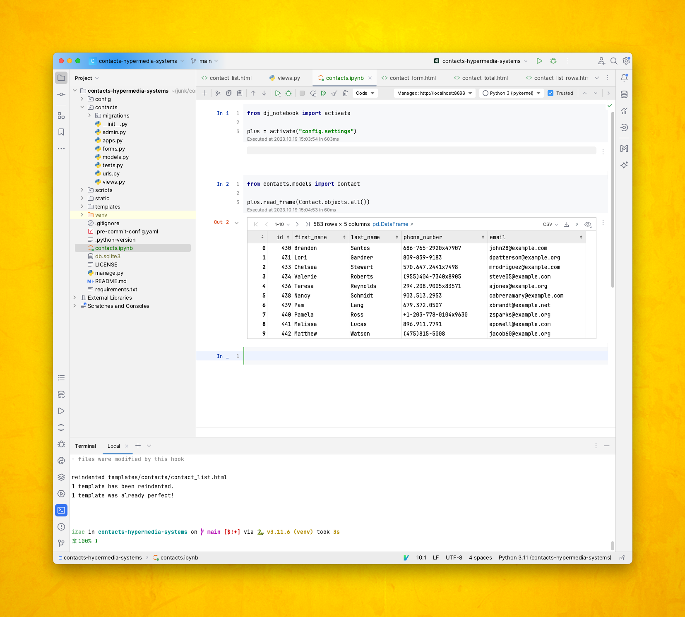

# Using dj-notebook with PyCharm

PyCharm Professional has built-in integration for Jupyter notebooks. This integration works well with dj-notebook once your jupyter and dj-notebook are added to your existing Django project's virtual environment.

## Quick Start

1. Open your existing django project in pycharm.
2. Make sure that pycharm's interpreter is configured for your project's virtual environment.
3. Add dj-notebook and jupyter to that virtual environment.
4. Create a new notebook and load your django settings in the first cell.
5. Execute that cell to launch the Jupyter server.

## Adding dj-notebook to your Virtual Environment

Once pycharm has loaded your django project, you can inspect the virtual environment used by the project's interpreter by using the interpreter menu in the lower right corner of the project window. Click on the current interpreter (1) then choose "Interpreter Settings..." to to confirm the location of the virtual environment and see which packages are loaded there.

If jupyter and dj-notebook are not already installed, you can add them from the IDE by clicking the add button then searching for dj-notebook:

Then click "Install Package":

## Using dj-notebook Within PyCharm's Integrated Notebook View

Once dj-notebook is installed, you can create a new notebook from within the project explorer:

In the new notebook, when you execute your first cell, PyCharm will start the Jupyter server and display the results inline. Once the server is started, dj-notebook [just works, as described in the usage guide](https://dj-notebook.readthedocs.io/en/latest/usage/). PyCharm's notebook interface [is documented here](https://www.jetbrains.com/help/pycharm/jupyter-notebook-support.html#ui).

